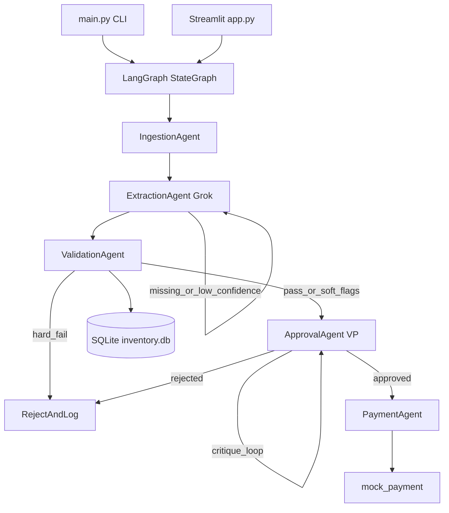

# Acme Invoice Automation

Multi-agent AP prototype for **Acme Corp** ([Galatiq case](https://github.com/galatiq-ai/galatiq-case-invoices)).

**Ingest → Extract → Validate → Approve (reflect) → Pay / Reject**

LangGraph + xAI Grok · Local SQLite · Mock payments · CLI + Streamlit

> Clean invoices pay in minutes; stock mismatches and fraud never hit the bank mock.  
> `python main.py --invoice_path=data/invoices/invoice_1001.txt`

## Quick start

```bash
python3 -m venv .venv
source .venv/bin/activate
pip install -r requirements.txt && pip install -e .

cp .env.example .env          # set XAI_API_KEY=...
python scripts/init_db.py --force

python main.py --invoice_path=data/invoices/invoice_1001.txt
python main.py --invoice_path=data/invoices/ --batch --dedupe-pdf
streamlit run app.py
pytest -q
```

No API credits? Add `--heuristic` (or toggle offline mode in Streamlit).  
Put keys only in `.env` — never commit it. Rotate any key shared in chat via [console.x.ai](https://console.x.ai).

## Architecture

```text
CLI / Streamlit
      ↓
 LangGraph StateGraph
      ↓
 ingest → extract ⟲ → validate → approve ⟲critique → pay|reject
                         ↓
                   SQLite inventory.db
```



| Agent | Role |
|---|---|
| Ingestion | PDF / TXT / JSON / CSV / XML |
| Extraction | Parsers first; Grok + self-correction for messy text |
| Validation | Inventory / vendor / price tools (hard vs soft) |
| Approval | VP persona, $10k scrutiny, critique loop |
| Payment | `mock_payment` only after validate **and** approve |

## Results

| Signal | Value |
|---|---|
| Sample suite STP | **8 / 16** approved + paid |
| Hard-stopped rejects | **8 / 16** (stock / fraud / unknown SKU / bad data) |
| Offline tests | **37 passed** |
| Live Grok | INV-1001 APPROVED + paid (~6–10s) |

| Invoice | Expected |
|---|---|
| INV-1001 / 1004 / 1006 / 1011 / 1015 | Approve → pay |
| INV-1002 | Reject — GadgetX over stock |
| INV-1003 | Reject — FakeItem / blocked vendor |
| INV-1008 / 1016 | Reject — unknown items |
| INV-1009 | Reject — negative qty / missing vendor |
| INV-1005 / 1007 / 1013 | Reject — aggregated over-stock |

## Configuration

| Env var | Default | Purpose |
|---|---|---|
| `XAI_API_KEY` | _(empty)_ | xAI key (local `.env` only) |
| `XAI_MODEL` | `grok-3` | Grok model |
| `INVENTORY_DB_PATH` | `inventory.db` | SQLite path |
| `APPROVAL_AMOUNT_THRESHOLD` | `10000` | VP scrutiny threshold |
| `CONFIDENCE_THRESHOLD` | `0.7` | Extraction retry threshold |

On 403/no credits, the client falls back to the offline heuristic automatically.

## Further reading

| Doc | Purpose |
|---|---|
| [docs/ARCHITECTURE.md](docs/ARCHITECTURE.md) | Agents, tools, state, threat model |
| [docs/DECISIONS.md](docs/DECISIONS.md) | Why LangGraph / parsers-first / one-way critique |
| [docs/BUSINESS_IMPACT.md](docs/BUSINESS_IMPACT.md) | PE pain → controls → next 30 days |
| [docs/DEMO.md](docs/DEMO.md) | 3-minute walkthrough |
| [docs/RUNBOOK.md](docs/RUNBOOK.md) | Failure modes & fixes |

## Non-goals

Real email ingest, ERP/banking rails, cloud deploy, SSO — deferred on purpose (see next-30-days in [BUSINESS_IMPACT.md](docs/BUSINESS_IMPACT.md)).
