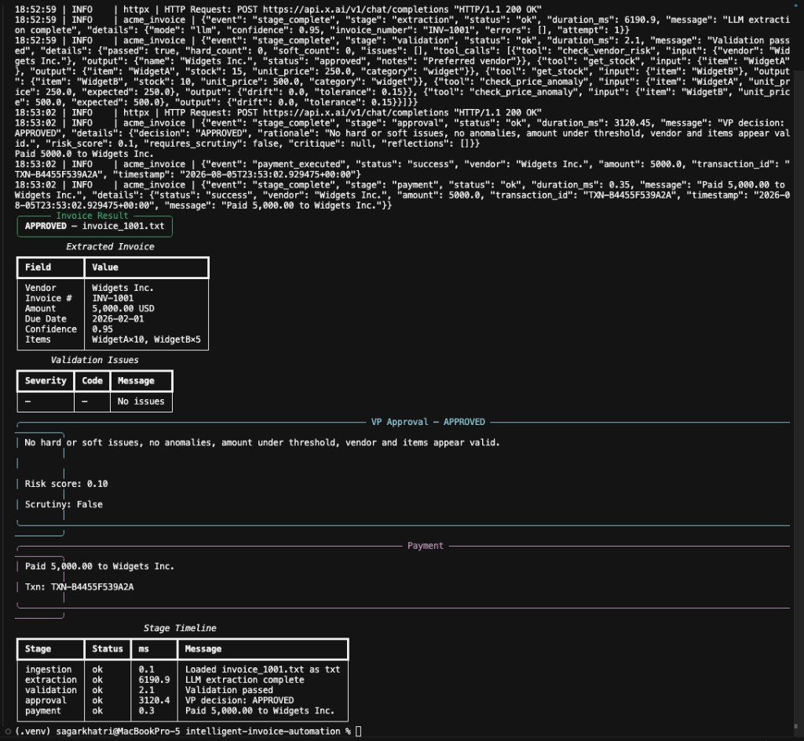
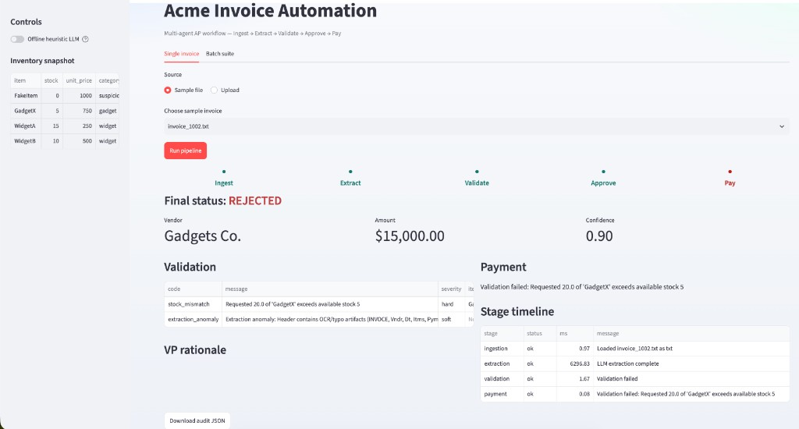
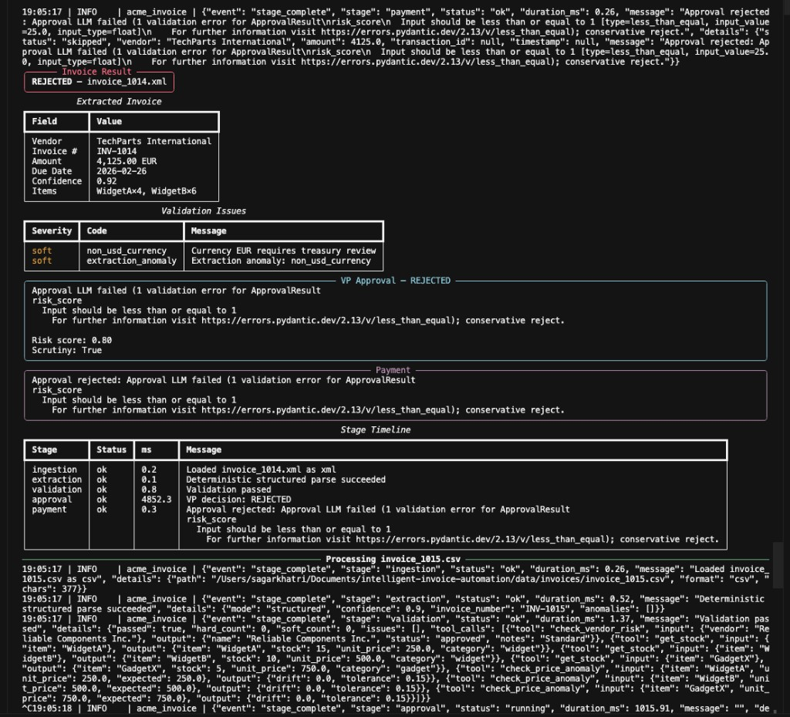
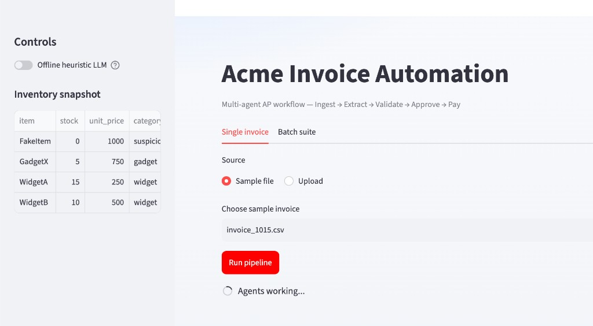
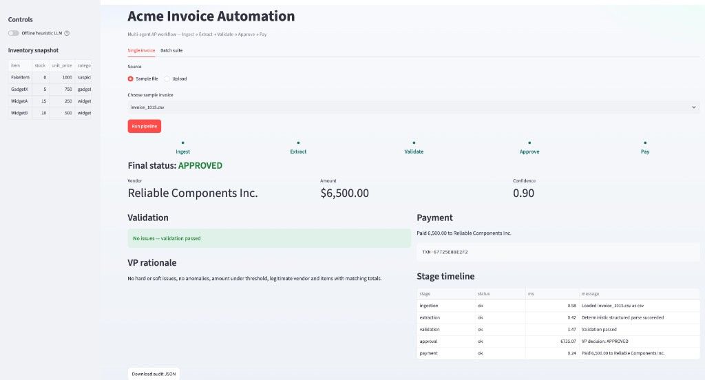
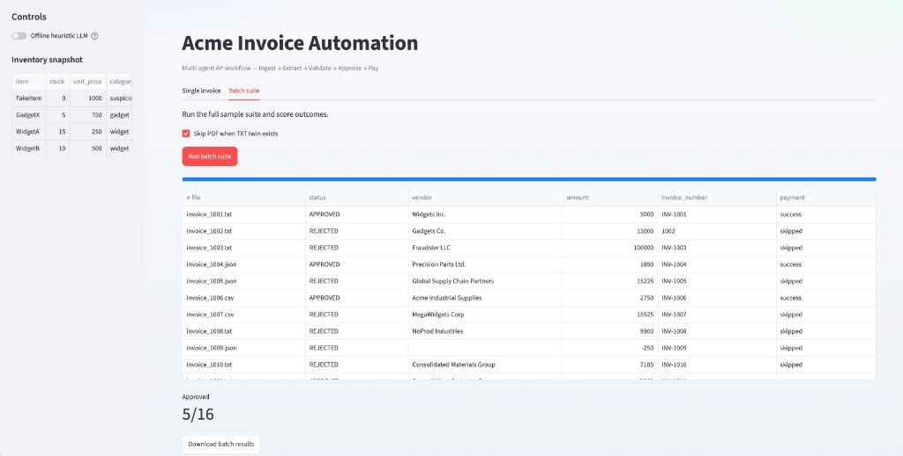
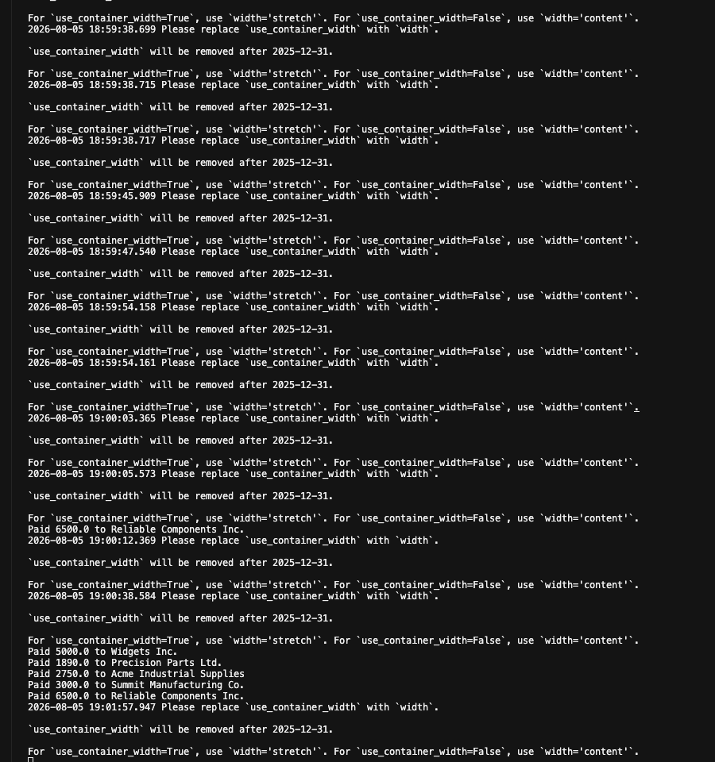

# Demo

3-minute walkthrough with screenshots as proof.

## Prep

```bash
source .venv/bin/activate
python scripts/init_db.py --force
# .env has XAI_API_KEY, or use --heuristic / Streamlit offline toggle
```

---

## 1. Happy path (STP)

```bash
python main.py --invoice_path=data/invoices/invoice_1001.txt
```

Clean invoice → validation passed → VP **APPROVED** → mock payment + txn id.



---

## 2. Stock mismatch (hard fail)

```bash
python main.py --invoice_path=data/invoices/invoice_1002.txt
```

Or run `invoice_1002.txt` in Streamlit. 20× GadgetX vs stock 5 → `stock_mismatch` → **REJECTED** → no payment.



---

## 3. Fraud / soft-flag scrutiny

```bash
python main.py --invoice_path=data/invoices/invoice_1003.txt
python main.py --invoice_path=data/invoices/invoice_1014.xml
```

- **INV-1003:** FakeItem / blocked vendor → auto-reject (see batch scoreboard in section 5).
- **INV-1014:** EUR soft flag → VP scrutiny → **REJECTED**.



---

## 4. Streamlit — single invoice

```bash
streamlit run app.py
```

Pick `invoice_1015.csv` → **Run pipeline**.

**Agents working:**



**Approved + payment:**



---

## 5. Streamlit — batch suite

**Batch suite** → **Run batch suite**. Scoreboard includes STP (1001) and rejects (1002 stock, 1003 fraud).



---

## 6. Payment proof (logs)

Mock bank calls only on **APPROVED** invoices:



---

## 7. Tests (optional)

```bash
pytest -q
```

37 offline tests — no API required.

